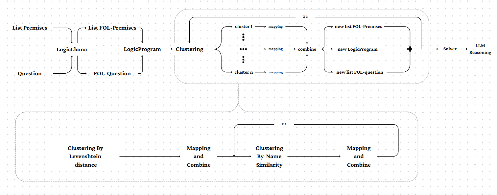
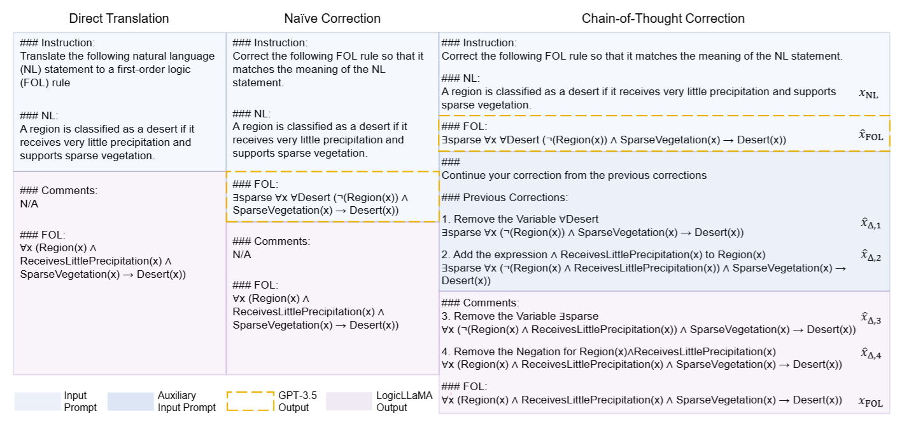

# **Explainable AI for Educational Question-Answering with Symbolic Reasoning**

## WORK FLOW


## EXISTING PROBLEM
**Natural Language to First-Order Logic Translation** (NL2FOL) is a task that challenges the contextual understanding capabilities of large language models (LLMs). **LogicLlama** is a pretrained model that has been fine-tuned to optimize for the NL2FOL task. LogicLlama has the following strengths and weaknesses:

- **Strengths:**
    - Understands the context of the statement well

    - Represents relationships between entities (predicate) in the sentence very effectively

    - Trained on several well-known datasets such as LogicNLI, FOLIO3, and MALLS
- **Weaknesses:**
    - LogicLlama is trained on individual statement-FOL pairs, which leads to inaccurate consistency in representing entity or predicate names. The predicates generated by LogicLlama also lack a certain level of abstraction—for example, it represents an instance as YearTwo(x) instead of using a more generalized form like Year(x, 2). This limitation is also mentioned in the original paper.

    


## MOTIVATION
The paper proposes a solution using GPT-4 to auto-correct incorrect entity names, employing two approaches: Naive and Chain-of-Thought (CoT). However, within the constraints of the competition, only models with fewer than 8 billion parameters are allowed. This limitation makes correction significantly more challenging. It served as the motivation for the team to develop a correction module based on LLMs with fewer than 8B parameters, rather than relying on GPT-4.

## MODULE EXPLAIN
```
    Detail Explanation will be updated Soon
```
